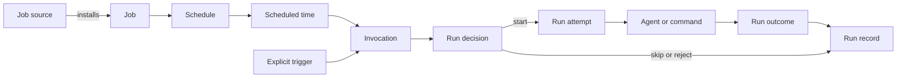
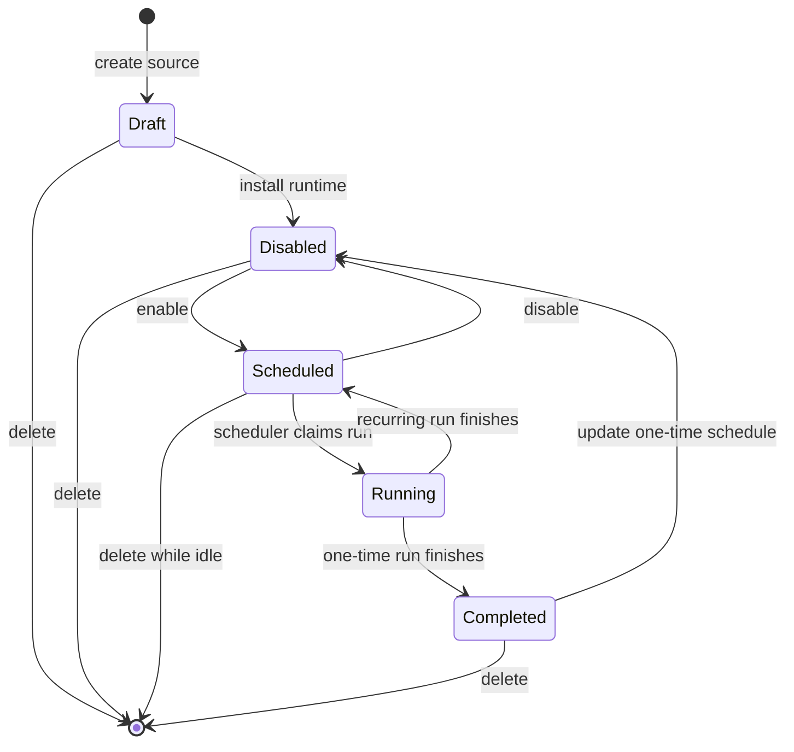

# Clockwork


> Schedule agent runs and code execution in a predictable way.

Clockwork is a local scheduler for recurring agent work and local commands. Define a job once, choose when it runs, and inspect a clear history of what happened.

## Define a job

Each managed job lives in `~/.agents/clockwork/jobs.d/<job>/`. The directory name and the `name` field in its source must match.

Register an agent profile before creating a prompt job. `clockwork agent detect` registers supported agents found on `PATH`, including Pi, Claude, Codex, Gemini, and OpenCode.

A profile can also fix the command, arguments, and working directory for one job. This Pi profile uses a stable session:

```sh
clockwork agent add pi-daily-brief \
  --bin "$(command -v pi)" \
  --cwd "~/path/to/project" \
  --prompt-stdin \
  --arg=--print \
  --arg=--mode \
  --arg=json \
  --arg=--model \
  --arg=provider/model \
  --arg=--thinking \
  --arg=high \
  --arg=--tools \
  --arg=read,bash,write \
  --arg=--approve \
  --arg=--session-id \
  --arg=clockwork-daily-brief \
  --arg=--session-dir \
  --arg="$HOME/.local/state/clockwork/pi-sessions/daily-brief"
```

Use `--no-approve` instead of `--approve` when the job must ignore project-local files. Arguments belong to the profile, so Claude, OpenCode, and custom agent commands use the same mechanism.

This weekday daily-brief job runs the profile at 09:00 from Monday to Friday:

```yaml
# ~/.agents/clockwork/jobs.d/daily-brief/clockwork.yaml
name: daily-brief # Must match the job directory.
schedule: "0 9 * * 1-5" # Monday to Friday at 09:00.
action:
  prompt:
    profile: pi-daily-brief # A profile from `clockwork agent list`.
    cwd: "~/path/to/project" # Optional; overrides the profile cwd.
    text: "Write today's daily brief."
timeout: 3600 # Maximum run time in seconds.
```

Definitions describe the schedule and action only. Activation is separate state owned by `clockwork job`; new jobs are disabled until you explicitly enable them. Jobs reference profiles but do not own them. Deleting a job leaves its profile in place.

To run code instead, use a command action:

```yaml
action:
  command:
    command: "scripts/refresh-index.sh" # Run a reviewed local command.
```

See the [agent-job template](./services/clockwork/templates/jobs/agent-prompt/) and the [command-job template](./services/clockwork/templates/jobs/command/) for complete examples.

## Schedule useful work


Use Clockwork for work that needs to happen without someone remembering to start it:

- Write a daily brief each weekday morning.
- Ask an agent to pull your Strava data and update you on marathon-training progress every three days.
- Pull data from a source every few hours.

Clockwork gives agent runs and local commands one scheduling model.

## See how a job runs




1. You define a job in a managed source.
2. `clockwork job` commands install the source into runtime state, disabled by construction.
3. A scheduled time or explicit trigger creates an invocation.
4. Clockwork starts, skips, or rejects that invocation.
5. Clockwork records the result.

## Run work predictably

- Schedule agent prompts and local commands from the same job format.
- Preview a job plan before you apply it.
- Keep a history of completed, failed, and skipped runs.
- Disable a job without losing its history.
- Handle missed and overlapping runs with explicit policy.
- Manage recurring and one-time jobs through a clear lifecycle.

## Install on macOS

Clockwork supports Apple silicon and Intel Macs. Download the installer from the latest GitHub Release, inspect it if you want to, then run it:

```sh
curl --proto '=https' --tlsv1.2 -fsSLO https://github.com/iurysza/clockwork/releases/latest/download/install.sh
sh install.sh
```

The default install verifies the downloaded archive and writes only `~/.local/bin/clockwork`. It does not create jobs, configure an agent, write a launchd plist, or start a service.

### Add the background service

Use the explicit opt-in when Clockwork should run schedules in the background. It installs the job directory, environment file, service helper, and an inactive launchd plist.

```sh
sh install.sh --with-service
```

It does not load launchd, create jobs, or run actions.

Register an agent profile, then create each job disabled. Review enablement separately:

```sh
clockwork agent detect
clockwork job create daily-brief --schedule "0 9 * * 1-5" --prompt "Write the daily brief." --profile pi --cwd "~/path/to/project"
clockwork job enable daily-brief --dry-run
clockwork job enable daily-brief --yes --if-revision <revision-from-dry-run>
```

Start the service after you have enabled the job:

```sh
clockwork-service start
```

## Manage jobs

Every job is managed. Sources live at `~/.agents/clockwork/jobs.d/<name>/clockwork.yaml`; activation is stored separately and never edited by hand. New jobs are disabled by construction. `enable` is the only command that starts future scheduling.

```text
clockwork job create <name> --schedule <expr> (--command <cmd> | --prompt <text> [--profile <name>] [--cwd <dir>] | --webhook <url>)
clockwork job update <name> [definition flags]
clockwork job enable <name>       # The only public activation path.
clockwork job disable <name>
clockwork job trigger <name>      # Explicit immediate run of an enabled job.
clockwork job delete <name>
clockwork job validate [<name>]
clockwork job status [<name>] --json
clockwork job list [--json]
clockwork job history <name> [--json]
clockwork job logs <name> [--json]
```

Mutating commands validate the complete operation, print the planned changes and external-effect classification, and require confirmation. Scripts run the command once with `--dry-run --json`, then repeat it with `--yes --if-revision <revision>`. For a relative one-time schedule such as `in 4h`, use the absolute `schedule` value from the preview when you apply. A stale revision changes nothing. Update and delete refuse to cross a run that is in flight.

## Job basics

| Term | Meaning |
| --- | --- |
| **Job** | A named unit of scheduled work. |
| **Schedule** | The rule that makes a job due. |
| **Invocation** | A request to run a job. |
| **Run decision** | Clockwork's decision to start, skip, or reject an invocation. |
| **Run record** | The saved result of a scheduler run. |

A job moves through this lifecycle:



## Documentation

- [Managed Clockwork service](./services/clockwork/README.md)
- [Installation reference](./docs/install.md)
- [Release process](./docs/releases.md)

## Development

For a source build, install the binary with Cargo. Add the service integration only when you need to test it:

```sh
cargo build --locked --release
install -m 755 target/release/clockwork "$HOME/.local/bin/clockwork"
node install.mjs --apply
```

Run the Rust and integration test suites:

```sh
cargo test --locked
npm test
```

Repository layout:

```text
src/                    Rust scheduler and CLI
services/clockwork/     Managed local service integration
skills/clockwork/       Agent-facing operating guidance
docs/                   Installation and release references
```
