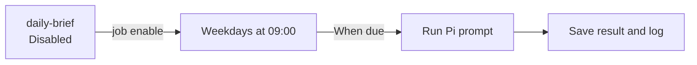

# Clockwork


Schedule agent prompts, local commands, and HTTPS webhooks on your machine.

Have an agent write your weekday brief, refresh a search index every few hours, or run a task once this afternoon. Clockwork saves the schedule and records each run's result and output so you can check what happened later.

- Use Pi, Claude, Codex, Gemini, OpenCode, or a custom agent command.
- Choose a cron schedule, a recurring interval, or a one-time run.
- Preview job changes before applying them. New jobs stay disabled until you enable them.
- Inspect run history and logs. Overlapping scheduled runs are skipped rather than started twice.

## Install on macOS

Prebuilt releases support Apple silicon and Intel Macs. Download and review the installer, then run it:

```sh
curl --proto '=https' --tlsv1.2 -fsSLO https://github.com/iurysza/clockwork/releases/latest/download/install.sh
sh install.sh
```

The installer verifies the archive's SHA-256 checksum and installs `~/.local/bin/clockwork`. It does not create jobs or start a service. Add `~/.local/bin` to your `PATH` if needed.

For background scheduling, add the optional macOS service. This requires Node.js and Python 3:

```sh
sh install.sh --with-service
```

Installation does not start the service. See [installation](./docs/install.md) for source builds and other ways to run the scheduler.

## Schedule your first agent job

Start in the project where the agent should work. The agent must already be installed and authenticated.

Detect available agents and review their registered commands:

```sh
clockwork agent detect
clockwork agent list
```

This example uses Pi. Replace `pi` with another profile from the list if needed:

```sh
clockwork job create daily-brief \
	--schedule "0 9 * * MON-FRI" \
	--prompt "Read this project's notes and write today's brief to daily-brief.md." \
	--profile pi \
	--cwd "$PWD" \
	--timeout 3600
```

In an interactive terminal, Clockwork shows the plan and asks for confirmation. Creation leaves the job `disabled`. Review the next run before enabling it:

```sh
clockwork job enable daily-brief
clockwork job status daily-brief
```

The job now reports `scheduled` with a future `Next run`. Cron uses your machine's local time, so this job is due at 09:00, Monday to Friday.

Start the service to run enabled jobs in the background:

```sh
clockwork-service start
```

After a run, check the result and read the agent's output:

```sh
clockwork job history daily-brief
clockwork job logs daily-brief
```

For scripts and agents, use the [preview-and-apply workflow](./docs/jobs.md#scripts-and-agents) instead of interactive confirmation.

## How a job runs

For the daily brief above:



Recurring jobs stay enabled for the next run. `clockwork job disable daily-brief` prevents future runs without deleting history. It does not stop an action already running.

To run an enabled, idle job immediately, use `clockwork job trigger daily-brief`. Clockwork previews that action and asks for confirmation too.

## Run commands and webhooks

For an existing script in your project:

```sh
clockwork job create refresh-index \
	--schedule "every 6h" \
	--command "./scripts/refresh-index.sh" \
	--workdir "$PWD"
```

Commands run without a shell by default. Add `--shell` for pipes, redirects, or shell built-ins. HTTPS webhooks use `--webhook` instead of `--command` or `--prompt`. Each job has one action, and each new job needs separate enablement.

Clockwork runs actions with your user account's permissions. It does not sandbox an agent or approve what it does. Review the agent's arguments and access before enabling unattended work.

## Documentation

- [Job reference](./docs/jobs.md): commands, definitions, states, and scripted changes.
- [Agent profiles](./docs/agents.md): detected defaults, custom arguments, and working directories.
- [Schedules and run results](./docs/scheduling.md): timing, missed runs, overlaps, and failures.
- [Background service](./services/clockwork/README.md): startup, environment, logs, and diagnostics.
- [Installation](./docs/install.md) and [releases](./docs/releases.md).

## Development

Build with the repository's pinned Rust toolchain and run the tests:

```sh
cargo build --locked
cargo test --locked
npm test
```

The Rust CLI and scheduler live in `src/`. The macOS service is in `services/clockwork/`, and `skills/clockwork/` contains the guidance embedded by `clockwork setup`.

Clockwork is [MIT licensed](./LICENSE).
