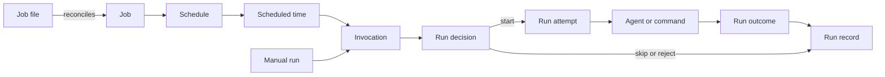
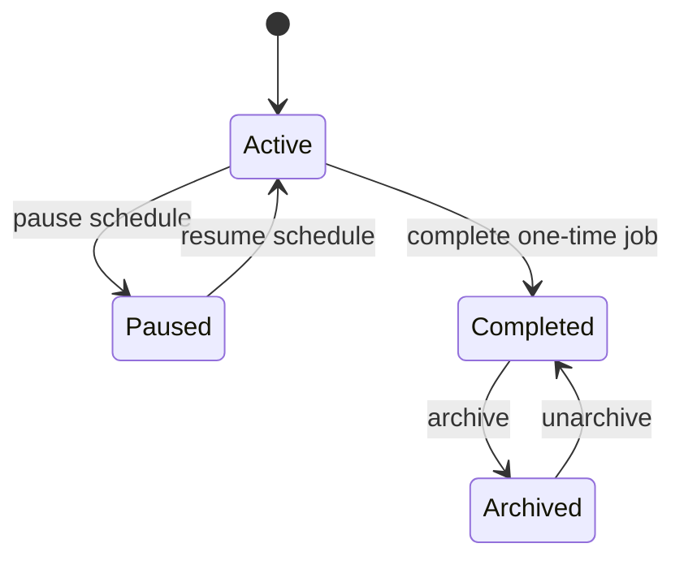

# Clockwork


> Schedule agent runs and code execution in a predictable way.

Clockwork is a local scheduler for recurring agent work and local commands. Define a job once, choose when it runs, and inspect a clear history of what happened.

## Define a job

Each managed job lives in `~/.agents/clockwork/jobs.d/<job>/`. The directory name, manifest name, and job key must match.

This weekday daily-brief job runs a Pi prompt at 09:00 from Monday to Friday:

```yaml
# ~/.agents/clockwork/jobs.d/daily-brief/clockwork.yaml
name: daily-brief # Must match the job directory.

jobs:
  daily-brief: # Must match the manifest name.
    schedule: "0 9 * * 1-5" # Monday to Friday at 09:00.
    agent: clockwork-pi-daily-brief # Managed Pi runner for this job.
    prompt: "Write today's daily brief." # Prompt sent to Pi.
    timeout: 3600 # Maximum run time in seconds.
    paused: true # Required when you first apply the job.
```

Agent jobs also need `pi-profile.json`. It fixes the working directory, model, thinking level, available tools, and project-file approval behaviour for each scheduled run.

```json
{
  "version": 1,
  "cwd": "~/path/to/project",
  "model": "provider/model",
  "thinking": "high",
  "tools": ["read"],
  "approveProjectFiles": false
}
```

To run code instead, replace `agent` and `prompt` with a `run` command:

```yaml
run: "scripts/refresh-index.sh" # Run a reviewed local command.
```

See the [agent-job template](./services/clockwork/templates/jobs/pi-prompt/) and the [command-job template](./services/clockwork/templates/jobs/command/) for complete examples.

## Schedule useful work


Use Clockwork for work that needs to happen without someone remembering to start it:

- Write a daily brief each weekday morning.
- Ask an agent to pull your Strava data and update you on marathon-training progress every three days.
- Pull data from a source every few hours.

Clockwork gives agent runs and local commands one scheduling model.

## See how a job runs




1. You define a job in a job file.
2. Clockwork reconciles the job into its managed state.
3. A scheduled time or manual run creates an invocation.
4. Clockwork starts, skips, or rejects that invocation.
5. Clockwork records the result.

## Run work predictably

- Schedule Pi prompts and local commands from the same job format.
- Preview a job plan before you apply it.
- Keep a history of completed, failed, and skipped runs.
- Pause a job without losing its history.
- Handle missed and overlapping runs with explicit policy.
- Manage recurring and one-time jobs through a clear lifecycle.

## Install on macOS

Clockwork supports Apple silicon and Intel Macs. Download the installer from the latest GitHub Release, inspect it if you want to, then run it:

```sh
curl --proto '=https' --tlsv1.2 -fsSLO https://github.com/iurysza/clockwork/releases/latest/download/install.sh
sh install.sh
```

The default install verifies the downloaded archive and writes only `~/.local/bin/clockwork`. It does not create jobs, configure an agent, write a launchd plist, or start a service.

### Add the Pi integration

Use the explicit opt-in only when you want Clockwork to schedule Pi jobs. It needs Node.js and Pi because it installs the Pi launcher, managed-job helper, job directory, environment file, and an inactive launchd plist.

```sh
sh install.sh --with-pi
```

It still does not load launchd, apply jobs, or send external requests.

Create the job directory and add `clockwork.yaml` and `pi-profile.json` from the templates. Check the job, inspect its plan, and apply it:

```sh
clockwork-jobs check daily-brief
clockwork-jobs plan daily-brief
clockwork-jobs apply daily-brief --confirm daily-brief --no-input
```

New managed jobs start paused. When you are ready, change only `paused` to `false`, then run `check`, `plan`, and `apply` again. Start the service after you have enabled the job:

```sh
clockwork-service start
```

## Manage jobs

Use these commands during normal operation:

```sh
clockwork-jobs check [job]        # Validate one job or all jobs.
clockwork-jobs plan [job]         # Preview the managed changes.
clockwork-jobs apply [job] --confirm <job|all> --no-input
clockwork-jobs status [job] --json
CLOCKWORK_HOME="$HOME/.local/state/clockwork" clockwork history --json
clockwork-service status
clockwork-service logs
```

To pause or resume a managed job, change `paused` in its `clockwork.yaml`, then check, plan, and apply the job again.

## Job basics

| Term | Meaning |
| --- | --- |
| **Job** | A named unit of scheduled work. |
| **Schedule** | The rule that makes a job due. |
| **Invocation** | A request to run a job. |
| **Run decision** | Clockwork's decision to start, skip, or reject an invocation. |
| **Run record** | The saved result of a scheduler run. |

A job moves through this lifecycle:



## Documentation

- [Managed Clockwork service](./services/clockwork/README.md)
- [Installation reference](./docs/install.md)
- [Release process](./docs/releases.md)

## Development

For a source build, install the binary with Cargo. Add the Pi integration only when you need to test it:

```sh
cargo build --locked --release
install -m 755 target/release/clockwork "$HOME/.local/bin/clockwork"
node install.mjs --apply
```

Run the Rust and integration test suites:

```sh
cargo test --locked
npm test
```

Repository layout:

```text
src/                    Rust scheduler and CLI
services/clockwork/     Managed local service and Pi integration
skills/clockwork/       Agent-facing operating guidance
docs/                   Installation and engine reference
```
