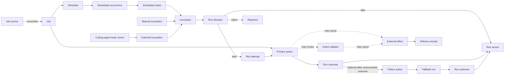
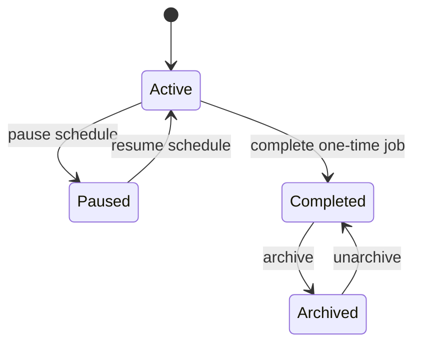

# Clockwork scheduling

Clockwork decides when a job may run, executes its action, and records the scheduler outcome. Provider-specific delivery and proof of delivery stay outside the scheduler.

## Model

## Language

**Job source**:
The user-owned declaration from which a managed job is created or updated. It is authoritative for managed configuration, but it is not runtime state.
_Avoid_: Generated state, live job file

**Job**:
A named schedulable unit containing one schedule, one primary action, and mutable lifecycle state.
_Avoid_: Task, plugin

**Schedule**:
The rule that creates scheduled occurrences. A schedule is one invocation source, not the action itself.
_Avoid_: Trigger, timer job

**Scheduled occurrence**:
One time selected by a schedule at which the job becomes due. Missed recurring times remain distinct occurrences when overlap and skip policy needs to account for them.
_Avoid_: Invocation, run

**Scheduled claim**:
A durable reservation for one scheduled occurrence made before its action process starts. A claim does not prove that execution has begun.
_Avoid_: In-flight run, active run

**Invocation**:
A request to apply Clockwork's run policy to an existing job. An invocation may start a run attempt, be skipped, or be rejected.
_Avoid_: Run, callback, plugin event

**Invocation source**:
The origin of an invocation, such as a schedule, an explicit manual command, or a future coding-agent hook. The source provides provenance but does not select a different action implementation.
_Avoid_: Trigger type

**Manual invocation**:
An explicit operator request to run a job outside its schedule. Its effect on paused and one-time jobs remains a product-policy decision.
_Avoid_: Forced run

**External invocation**:
A future invocation requested by another local tool, with a bounded source label for audit. It enters the same admission and completion path as other invocations, with source-specific policy, and does not require a plugin API.
_Avoid_: Hook action, external trigger plugin

**Run decision**:
Clockwork's decision to start, skip, ignore, or reject an invocation based on job state, claim identity, and execution availability.
_Avoid_: Validation result

**Run attempt**:
An admitted invocation whose primary action has started or is about to start under the job's execution lock.
_Avoid_: Invocation, scheduled claim

**Primary action**:
The command, prompt, or webhook a job is defined to perform. Every invocation of the job targets the same primary action.
_Avoid_: Handler, plugin

**Run outcome**:
The classified result of an attempted action: success, failure, timeout, or internal error. Skips and rejections are run decisions, not action outcomes.
_Avoid_: Exit code

**Run record**:
Clockwork's persisted audit record for a completed or skipped scheduler run. It proves the scheduler result, not that an external provider completed delivery.
_Avoid_: Delivery receipt

**Failure action**:
An optional command requested after an unsuccessful primary run. It is follow-up policy, not another invocation source for the primary action.
_Avoid_: Failure plugin, retry

**Fallback run**:
The execution of a failure action, linked to the unsuccessful primary run that caused it. It does not change the job's schedule.
_Avoid_: Fallback trigger, primary run

**Action adapter**:
An external executable that a command or prompt action may invoke for provider-specific work. The adapter owns provider protocol, credential use, and provider-specific evidence.
_Avoid_: Plugin, embedded SDK

**External effect**:
A change outside Clockwork, such as sending a message, updating a remote system, or starting an agent session. The job owner must define its idempotency and safety rules.
_Avoid_: Successful run

**Delivery receipt**:
Provider-facing evidence that an external effect completed or became ambiguous. The action adapter or job owner owns it; a run record cannot replace it.
_Avoid_: Run record, log

**Coding-agent hook**:
A future local caller that requests an external invocation through Clockwork's command boundary. It does not run inside Clockwork or grant Clockwork control of a live agent session.
_Avoid_: Agent plugin, steering server
