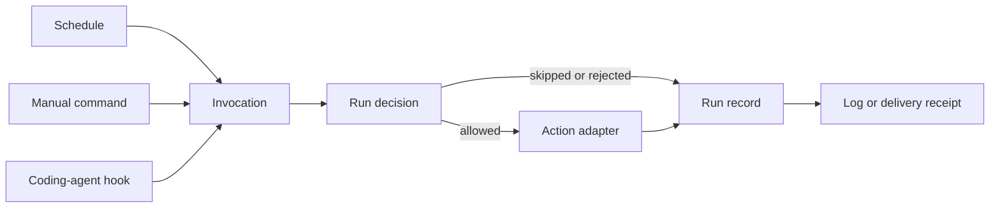

# Clockwork extension points

Status: research. No architecture decision or implementation is approved.

## Finding

Clockwork should stay a local scheduler and process runner. It should not become a plugin host or an agent platform.

The useful future boundary is an **invocation**: a request to run an existing job. A schedule is one invocation source. A manual command or coding-agent hook can become another source without changing the job action.



## Current boundaries

| Boundary | Current code | Finding |
| --- | --- | --- |
| Due-run selection | `src/engine/dispatcher.rs` | It claims due jobs and starts internal execution processes. |
| Run lifecycle | `src/engine/executor.rs` | It combines run policy, state changes, logs, process launch, HTTP, and fallback launch. |
| Action model | `src/model/action.rs` | The model has command, Pi prompt, and webhook actions. |
| Run origin | `src/model/run_record.rs` | `Trigger` records scheduled, manual, and fallback runs. |
| Pi boundary | `services/clockwork/pi-launcher.mjs` | It validates a narrow profile, derives a durable session ID, and starts Pi. It does not control a live Pi process. |

## Proposed shape

### Keep a small functional core

Extract pure decisions only when changing the dispatcher or executor next.

- `claim_due_runs(state, now)` decides which scheduled runs can be claimed.
- `decide_run(job, invocation)` decides whether a run can begin.
- `complete_run(job, outcome, now)` returns the next job state, a run record, and any fallback request.

The imperative shell keeps clocks, locks, files, process launch, HTTP, logs, and receipts. Do not introduce a framework or a broad trait hierarchy.

### Add one future ingress command

When a second real non-schedule caller exists, add a narrow command such as:

```sh
clockwork trigger <job> --source <name> --json
```

It must use the same lock, run decision, state transition, history, and action execution as a scheduled run. `--source` is an audit label. It is not a new action type.

A coding-agent hook can then invoke this command. Clockwork does not need to embed a coding-agent SDK or know how the hook fired.

### Keep action adapters outside the engine

Use the existing command boundary for integrations. A job action starts an approved adapter executable, and the adapter owns provider-specific protocol details. `clockwork-pi` is the first example.

Do not add dynamic plugins, an adapter registry, or a new hook action now. A command action already supports an adapter process.

## Pi steering

Do not add in-session steering now.

A durable Pi session ID identifies persisted history. It does not prove that a Pi process is live or provide a safe control channel. A future `clockwork-pi steer` adapter needs all of these before Clockwork can invoke it:

- a supported Pi API for a live session;
- proof that the exact session is live;
- a bounded steering request with an audit record;
- safe handling of unavailable or exited sessions;
- redaction of request content from logs and receipts.

Steering is an adapter capability. Clockwork may request it through an explicit command later. Clockwork must not own Pi session transport.

Laptop password injection does not belong in Clockwork's generic action or steering model. It is a privileged local capability. If it is ever needed, it needs a separate consented adapter with a narrow scope, short lifetime, no durable secret data, and a visible user approval boundary.

## Options

| Option | Result | Verdict |
| --- | --- | --- |
| Keep the current shape | Smallest codebase. Hooks use existing command jobs. | Safe now, but invocation provenance stays limited. |
| Add a narrow invocation command later | Preserves one lifecycle for schedules, manual runs, and hooks. | Recommended when a second real caller exists. |
| Build a trigger or plugin framework now | Adds registries, lifecycle rules, and compatibility cost without a proven adapter. | Reject. |
| Add Pi steering now | Needs a live-session protocol that the current launcher does not have. | Reject. |

## Start criteria

Start the refactor only when one of these happens:

- a coding-agent hook must trigger an existing job and needs a recorded source;
- a second non-schedule caller needs the same overlap and retry rules as a schedule;
- an action adapter needs the same outcome and receipt semantics as `clockwork-pi`.

Until then, preserve the current external command boundary and keep the scheduler focused.

## Open questions

- Should the first new invocation source be a generic local CLI caller or a Pi lifecycle hook?
- Which Pi live-session control API, if any, is stable enough to support steering?
